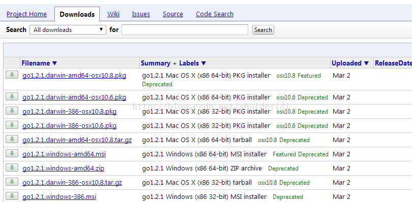
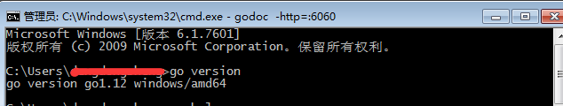

### GO语言环境搭建

------

####  1. Go语言官网

> https://code.google.com/p/go/downloads/list

#### 2. GitHub地址

> https://github.com/golang/go

#### 3. Go下载工具包准备

> 根据系统版本下载对应系统的安装包



#### 4. 环境变量配置

	>1. 新建系统变量 GOBIN 变量值  c:\go\bin
	>2. 新建变量名GOARCH 变量值  386 ，这个值参考下载包的版本号
	>3. 新建 变量名：GOOS 变量值：windows
	>4. 新建 变量名： GOROOT 变量值：c:\go
	>5. 编辑 Path 在Path的变量值的最后加上 %GOBIN%
	>6. 设置GOPATH , 值不能和GOROOT一致

注 ： 如果是msi安装文件，Go语言的环境变量会自动设置好。如果后面的测试无法通过，可以重新设置环境变。

如果go命令不能识别， 并且环境变量只有path和GOROOT ，另外两个没有，自行测试

#### 5. 检测是否成功

打开cmd.exe执行 go -version  或者 go -help 是否出现对应的命令结果



#### 6. 本地官方文档查看

> SDK安装好了之后，本地会自带一份官方文档，使用  godoc -http=:6060启动本地服务
>
> 访问： http://localhost:6060/doc/install 进行查看

#### 7. linux安装

1 . 在/usr/local目录下创建一个go文件夹 , 例如:

```linux
tar -C /usr/local -xzf go$VERSION.$OS-$ARCH.tar.gz
```

通常，这些命令必须以root身份运行或通过`sudo`。

添加`/usr/local/go/bin`到`PATH`环境变量。您可以通过将此行添加到您的`/etc/profile` （用于系统范围的安装）或`$HOME/.profile`：

```
export PATH = $ PATH：/usr/local/go/ bin
```

**注意**：`profile`在下次登录计算机之前，对文件所做的更改可能不适用。要立即应用更改，只需直接运行shell命令或使用如下命令从配置文件中执行它们 `source $HOME/.profile`  例如： source /etc/profile。


#### 8. 测试Hello Word

> 如果要进行测试需要设置GOPATH环境变量
>
> 1. 新建系统变量 GOPATH 变量值  E:\goworkspace ，linux自行定义位置
>
> 2. 在GOPATH下建立src/hello文件夹
>
> 3. 创建一个hello.go文件，并编写如下代码
>
>    ```go
>    package main
>    
>    import "fmt" 
>    
>    func main(){
>    
>    	fmt.Printf("hello word\n")
>    	
>    }
>    ```
>
> 4. 打开cmd.exe , 定位到 hello.go目录下 ： 
>
>    ```linux
>    cd  E:\goworkspace\src\hello
>    ```
>
> 5. 执行 go build  ， 执行 go run hello.go  运行
>
> 6. 执行上面的命令后，在源代码旁边的目录中会构建一个可执行文件，执行他可以看到问候语

注 ：  运行`go install`将二进制文件安装到工作区的`bin`目录中或`go clean -i`将其删除。

#### 9. 安装额外的Go版本 

例如，在同一台机器上安装多个Go版本可能很有用，以确保软件包的测试在多个Go版本上传递。一旦安装了Go版本，就可以安装另一个版本（例如1.10.7），如下所示：

```
$ go get golang.org/dl/go1.10.7
$ go1.10.7 download
```

新下载的版本可以像`go`：

```
$ go1.10.7 version
go version go1.10.7 linux/amd64
```

注： 如果需要使用以上命令需要翻墙，Go官网在外网地址

#### 10.  卸载GO

要从系统中删除现有的Go安装，请删除该 `go`目录。这Linux、macOS和FreeBSD 通常在`/usr/local/go` 目录下，Windows 默认在`c:\Go` 下。

您还应该从`bin` `PATH`环境变量中删除Go 目录 。在Linux和FreeBSD下你应该编辑`/etc/profile`或 `$HOME/.profile`。如果您使用[macOS软件包](http://localhost:6060/doc/install#macos)安装了Go，那么您应该删除该`/etc/paths.d/go`文件。Windows用户应阅读有关[在Windows下设置环境变量](http://localhost:6060/doc/install#windows_env)的部分。